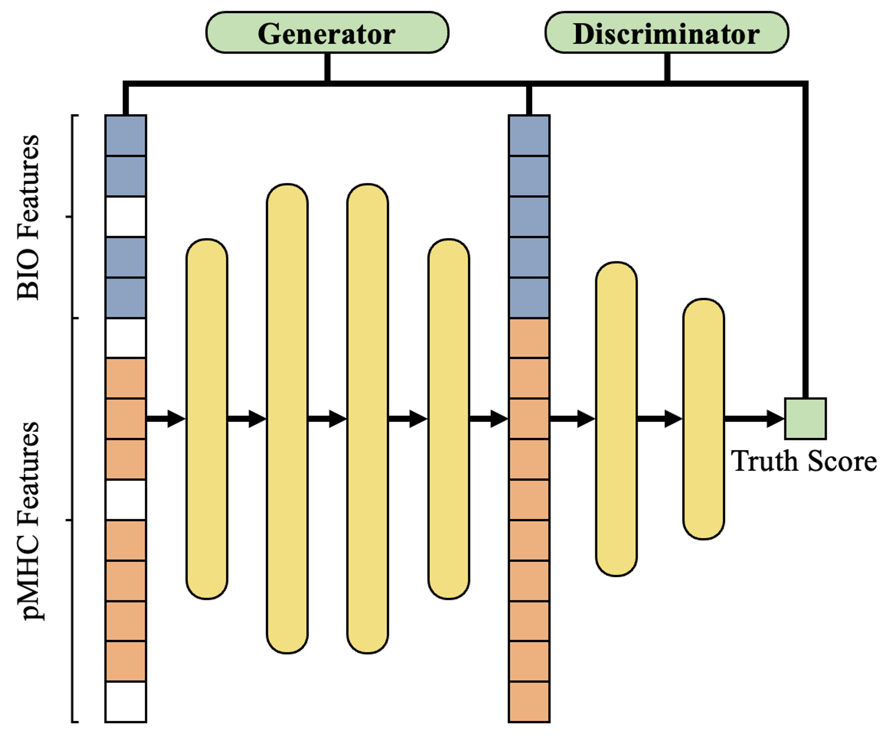

# SIGANEO-GAN
A GAN-like model for imputing feature before immunogenic neoepitope prediction. It can accept inputs with missing data and outputs the normalized complete feature after imputation, which can be used for training or prediction of subsequent models.

# Input & Output

| File   | Format | Path |  |
|--------| --- | --- | --- |
| Input  | csv | /data/raw_data/{DIR} | Data files that need to be imputed or normalized. |
| Output | csv | /data/gan_data/{DIR} | The complete dataset after imputing and normalization. |

# Usage method

1. Download this GitHub repository.
2. Enter the root directory of this project.
3. Place the data that needs to be imputed or normalized into the specified directory according to the instructions in the "Input & Output" section.
4. Execute 'python ./SIGANEO_GAN.py’.
5. The imputed/normalized data will be placed in the corresponding output directory specified in the "Input & Output" section.

# Environment
- os
- tqdm
- scikit-learn==1.0.1
- pandas==1.3.4
- numpy==1.18.5
- pytorch=1.9.0=py3.7_cuda11.1_cudnn8.0.5_0

# Feature

In our data imputation algorithm, we expect your input to contain the following features. It's worth noting that while our model has the ability to impute, the more complete the data, the better the imputation results. In addition to imputing data, if it is complete data, we also strongly recommend normalizing it through our SIGANEO-GAN module, which will accelerate the efficiency of subsequent model inference.

- RNA_ref_read_count
- RNA_alt_read_count
- Gene_FPKM
- Gene_TPM
- VAF
- ah1
- ah2
- MHCFlurry_aff
- MHCFlurry_rank
- NetMHCPan_aff
- NetMHCPan_rank
- NetMHCstabpan_Thalf(h)
- NetMHCstabpan_rank
- MATHLA_aff
- Recognition_score

# Citation
1. Jia Q, Wu W, Wang Y, Alexander PB, Sun C, Gong Z, Cheng JN, Sun H, Guan Y, Xia X et al: Local mutational diversity drives intratumoral immune heterogeneity in non-small cell lung cancer. Nature communications 2018, 9(1):5361.
2. He Y, Ramesh A, Gusev Y, Bhuvaneshwar K, Giaccone G: Molecular predictors of response to pembrolizumab in thymic carcinoma. Cell reports Medicine 2021, 2(9):100392.
3. Kang HG, Hwangbo H, Kim MJ, Kim S, Lee EJ, Park MJ, Kim JW, Kim BG, Cho EH, Chang S et al: Aberrant Transcript Usage Is Associated with Homologous Recombination Deficiency and Predicts Therapeutic Response. Cancer research 2022, 82(1):142-154.
4. Lee HW, Chung W, Lee HO, Jeong DE, Jo A, Lim JE, Hong JH, Nam DH, Jeong BC, Park SH et al: Single-cell RNA sequencing reveals the tumor microenvironment and facilitates strategic choices to circumvent treatment failure in a chemorefractory bladder cancer patient. Genome medicine 2020, 12(1):47.
5. Restrepo P, Yong R, Laface I, Tsankova N, Nael K, Akturk G, Sebra R, Gnjatic S, Hormigo A, Losic B: Tumoral and immune heterogeneity in an anti-PD-1-responsive glioblastoma: a case study. Cold Spring Harbor molecular case studies 2020, 6(2).
6. Codrich M, Dalla E, Mio C, Antoniali G, Malfatti MC, Marzinotto S, Pierobon M, Baldelli E, Di Loreto C, Damante G et al: Integrated multi-omics analyses on patient-derived CRC organoids highlight altered molecular pathways in colorectal cancer progression involving PTEN. Journal of experimental & clinical cancer research : CR 2021, 40(1):198.
7. Reynisson B, Alvarez B, Paul S, Peters B, Nielsen M: NetMHCpan-4.1 and NetMHCIIpan-4.0: improved predictions of MHC antigen presentation by concurrent motif deconvolution and integration of MS MHC eluted ligand data. Nucleic acids research 2020, 48(W1):W449-W454.
8. O'Donnell TJ, Rubinsteyn A, Bonsack M, Riemer AB, Laserson U, Hammerbacher J: MHCflurry: Open-Source Class I MHC Binding Affinity Prediction. Cell systems 2018, 7(1):129-132 e124.
9. Ye Y, Wang J, Xu Y, Wang Y, Pan Y, Song Q, Liu X, Wan J: MATHLA: a robust framework for HLA-peptide binding prediction integrating bidirectional LSTM and multiple head attention mechanism. BMC bioinformatics 2021, 22(1):7.
